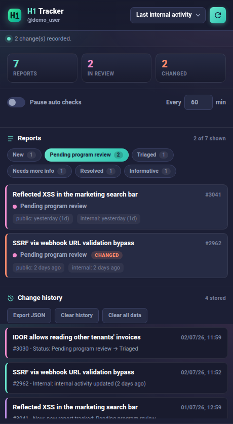

<div align="center">


# H1 Tracker

**A privacy-first Chrome/Brave extension that tracks your own HackerOne reports — status changes, internal activity, and public activity — in a local, exportable history.**

Styled to match HackerOne's own dark UI: navy surfaces, the signature mint accent, and status colours that mirror the platform.


</div>

---

## Why

HackerOne notifies you about some events, but there is no single place to see, at a glance, which of *your* reports moved, when the program last touched them internally, and what changed since you last looked. H1 Tracker keeps that timeline for you, locally, and highlights what changed.

It pays special attention to `report_pending_party_last_activity` — HackerOne's **"Last internal activity"** field — which often moves before any public comment appears.

<div align="center">

</div>

## What it does

- **Tracks every one of your reports** on a schedule you control.
- **Detects and records changes** — new reports, status (substate) transitions, internal-activity updates, and public-activity updates — into a local change history.
- **Highlights what moved** since your last look with a coral `CHANGED` marker and a badge count on the toolbar icon.
- **Sorts and filters** by last internal activity (default), newest/oldest, last public activity, status, or report number, and filters by substate.
- **Exports the change history** as JSON.
- **Exports full reports** — all of them, or a selection you pick — as readable **Markdown** or complete **JSON**, including the report body, the full comment timeline from every party (reporter, program, triage), internal-comment flags, bounties, severity, weakness, and metadata.
- **Stays quiet when you want** — pause automatic checks, tune the interval, or clear all local data at any time.

## The interface

| Main view | Filter + change detection |
|---|---|
|  |  |

- **Stat tiles** — total reports, how many are in review, and how many changed since you last opened the popup.
- **Report cards** — a status dot and left accent bar colour-coded per substate (blue `new`, pink `pending program review`, mint `triaged`, violet `needs more info`, and so on), the report `#id`, and both public and internal activity ages.
- **Change history** — a colour-coded timeline of what changed and when, each entry linking straight to the report.

## Safety model

The extension has **no dependencies, no build step, no remote code, no analytics, and no third-party network destinations.** The only network request in the source is `fetch("/graphql")`, executed inside a `hackerone.com` tab, so it goes to HackerOne on the same origin as the real site.

It reads HackerOne's CSRF token from the page and reuses your existing browser session. It never asks you to paste cookies or API keys. Report data is stored only in Chrome local extension storage (`chrome.storage.local`), and report exports are streamed straight to a downloaded file without being persisted by the extension.

The full-report export uses the **same permissions and the same `fetch("/graphql")` endpoint** as tracking — it adds no host permissions and no new network destinations. It only sends additional GraphQL queries to HackerOne to read the report body and activity timeline you already have access to.

The extension has permission to run code on `https://hackerone.com/*`, which is required for the same-origin GraphQL request. Review changes before pulling future updates (see below).

## Install

1. Open `chrome://extensions` (or `brave://extensions`).
2. Enable **Developer mode**.
3. Click **Load unpacked**.
4. Select the folder you cloned this repo into.
5. Open `https://hackerone.com` and sign in.
6. Click the H1 Tracker icon and press the refresh button.

There is no `npm install` and no build command.

## Use

- **Refresh** (top-right) runs a manual check immediately.
- **Pause auto checks** stops scheduled checks; manual refresh still works.
- **Every N min** controls the alarm interval, clamped between 15 and 1440 minutes.
- **Change history** keeps the newest 500 changes by default.
- **Export JSON** (history panel) downloads the stored change history.
- **Clear history** removes only the history.
- **Clear all data** removes stored reports, snapshots, errors, and history. Settings are kept.

### Export reports

The **Export reports** panel downloads the full content of your reports:

- **Format** — `Markdown (readable)` produces one human-readable file with each report's body and a chronological timeline; `JSON (full data)` produces the complete raw structure for tooling.
- **Download all** — exports every tracked report.
- **Select reports** — turns the report list into a picker; tap reports to select them (or **Select all**), then **Download selected**.

Each export is fetched live from HackerOne when you click, bundled into a single file, and **not stored by the extension**. Large sets take a little longer because every report's body and full comment timeline are pulled page by page. If HackerOne's schema hides a field for your account, that field is simply omitted and the rest still exports.

## Verify before updates

Before reloading the extension after an upstream update:

```sh
git fetch origin
git diff HEAD..origin/main
```

Look for new host permissions, remote URLs, install scripts, obfuscated code, cookie access, or requests to non-HackerOne domains.
