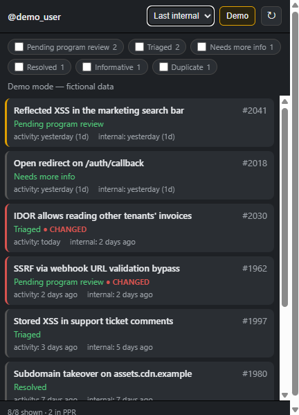

# H1 Report Tracker (Chrome extension)

A Chrome extension that watches your HackerOne reports and alerts you when their
status changes. Its main reason to exist is **internal activity**.



> The screenshot above uses fictional sample data, not real reports.

## Why "internal activity"

HackerOne already emails you and pushes a notification for **public** events on your
reports: a new comment, a state change, a bounty, a request for more info. You never miss
those because they land in your inbox.

What HackerOne does **not** tell you about is **internal activity**: the moment the program
or the triage team touches your report behind the scenes without posting anything public.
In the HackerOne UI this is the **"Last internal activity"** field, exposed in the API as
`report_pending_party_last_activity`. It often moves days before any public reply appears,
so it is an early signal that someone is actually looking at your report.

This extension exists to surface exactly that signal. It polls your reports, compares each
one against the previous check, and notifies you when the internal activity timestamp moves,
even when nothing public has happened yet. The same diff also catches `substate` changes and
new public activity, so the popup stays a complete picture, but internal activity is the part
you cannot get anywhere else.

## What it tracks

For every one of your reports the extension records three things at each check:

- **substate**: New, Pending program review, Triaged, Needs more info, Resolved, and so on.
- **internal** (`report_pending_party_last_activity`): the "Last internal activity" timestamp.
- **activity** (`latest_activity_at`): the last public activity timestamp.

A change in any of the three is reported, but the internal one is the value you would
otherwise have no way of seeing without opening each report by hand.

## How it works

1. **Your own session.** The extension reuses the HackerOne session already logged in to your
   browser. There is nothing to configure, no cookie or token to paste.
2. **Background check every 60 minutes.** A `chrome.alarms` timer triggers a check. You can
   also force one from the popup with the refresh button.
3. **GraphQL inside a HackerOne tab.** HackerOne returns `403` for `/graphql` requests coming
   from the extension origin, so the query runs **inside a hackerone.com tab** via
   `chrome.scripting.executeScript`, which is the same origin as the real site. The CSRF token
   is read from the `<meta name="csrf-token">` element on that page. If a hackerone.com tab is
   already open it is reused silently, otherwise a hidden background tab is opened, queried,
   then closed.
4. **Diff against the last check.** The previous snapshot is stored locally. The new data is
   compared report by report, and a change is raised for a substate change, a new internal
   activity, or a new public activity.
5. **Badge and notification.** The red badge on the toolbar icon shows the number of changes
   since you last opened the popup. A system notification lists what changed, and clicking it
   opens HackerOne.

## The popup

Click the toolbar icon to open the list. Each card shows:

- the report title and its number,
- the current substate,
- **activity**: last public activity (`latest_activity_at`),
- **internal**: last internal activity (`report_pending_party_last_activity`).

Controls:

- **Sort** by newest, oldest, last activity, last internal, status, or report number.
- **Filter chips** to show only certain substates (for example only Pending program review).
- Cards that changed since the last check are highlighted, and a **CHANGED** badge is shown.
- Clicking a card opens that report.

## Installation

1. Open Chrome and go to `chrome://extensions`.
2. Enable **Developer mode** (top right).
3. Click **Load unpacked**.
4. Select the cloned `h1-tracker` folder.
5. Make sure you are **signed in to hackerone.com** in a tab.

The H1 icon appears in the toolbar. Click it to see your reports. If you see "Not logged in",
open hackerone.com, sign in, then press the refresh button.

## Scope and privacy

- Only **your own** reports are queried (filter `reporter.id = me._id`).
- No report data ever leaves your browser. Everything is read from your live HackerOne session
  and stored in `chrome.storage.local` on your machine.
- There are no API keys, tokens, or credentials in the source. The CSRF token is read at
  runtime from the HackerOne page, never hardcoded.

## Change the check frequency

In the service worker console (`chrome://extensions`, open the extension, click
*service worker*):

```js
chrome.storage.local.set({ periodMin: 30 });
chrome.alarms.create("h1-check", { periodInMinutes: 30 });
```
